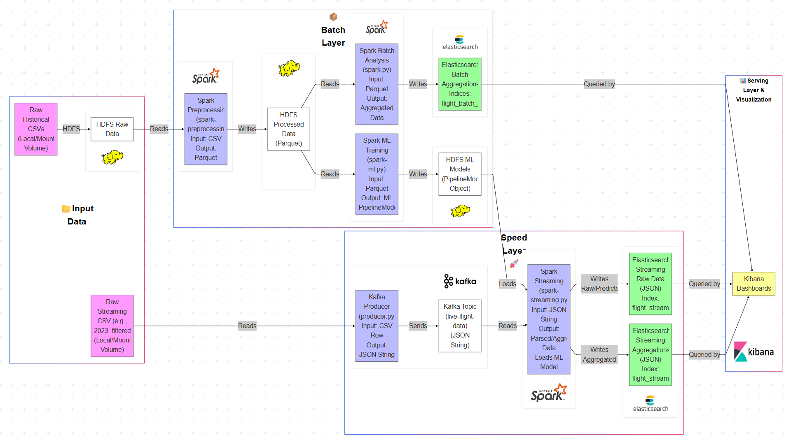
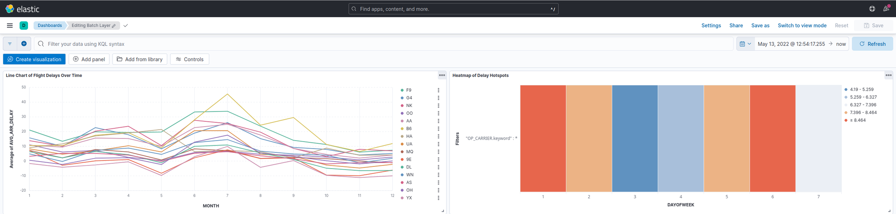

# Flight Analysis with Lambda Architecture on Spark, Kafka, and Elasticsearch

This project implements a Lambda architecture to analyze and predict performance for domestic flights in the United States. The dataset encompasses flight information with attributes such as origin and destination airports, scheduled and actual arrival/departure times, delay durations (including specific reasons), cancellation details (including codes), airline identifiers, flight distances, and more.

Statistical analyses are performed across various time granularities (e.g., total, annual, monthly, day-of-week) to understand trends and patterns. For example, average arrival/departure delays and cancellation/diversion rates are calculated per airline over different time periods. Predictive analyses are conducted using Apache Spark MLlib, specifically focusing on predicting flight delays. A Support Vector Machine (LinearSVC) model is trained and utilized for this prediction task.

To handle the large-scale data processing, Apache Spark is used for batch operations. Spark Streaming, in conjunction with Apache Kafka, enables near real-time analysis of incoming flight data. Elasticsearch serves as the primary persistent storage for both batch and streaming analysis results, facilitating efficient querying and visualization via Kibana.

Docker and Docker Compose are employed for containerizing and managing the entire infrastructure, including Kafka, Zookeeper, Spark (master/worker), Elasticsearch, and Kibana, ensuring ease of deployment, scalability, and reproducibility.

## Table of Contents

- [Requirements](#requirements)
  - [Setup Python Environment](#setup-python-environment)
- [Dataset](#dataset)
  - [Data Source](#data-source)
  - [Columns](#columns)
- [Architecture](#architecture)
  - [Batch Layer](#batch-layer)
  - [Speed Layer](#speed-layer)
  - [Serving Layer & Visualization](#serving-layer--visualization)
- [How to Run](#how-to-run)
- [Results and Visualization](#results-and-visualization)

## Requirements

This section outlines the software requirements for the project.

| Requirement                                                                | Docker Image/Tech Stack             | Version (Approx.) | Description                                                                                                                               |
|----------------------------------------------------------------------------|-------------------------------------|-------------------|-------------------------------------------------------------------------------------------------------------------------------------------|
| [Docker & Docker Compose](https://docs.docker.com)                         | N/A                                 | Latest            | Platform for containerization and orchestration.                                                                                          |
| [Apache Kafka](https://kafka.apache.org/documentation/)                    | `confluentinc/cp-kafka`             | 7.9.0             | Distributed streaming platform for real-time data ingestion.                                                                              |
| [Apache Zookeeper](https://zookeeper.apache.org/)                          | `confluentinc/cp-zookeeper`         | 7.9.0             | Centralized service for Kafka coordination.                                                                                               |
| [Apache Spark](https://spark.apache.org/docs/latest/)                      | `bitnami/spark` (base for custom)   | 3.5.3             | Distributed computing system for big data analytics (Core, SQL, Streaming, MLlib).                                                        |
| [Apache Hadoop (HDFS)](https://hadoop.apache.org/docs/stable/)             | Local Installation                  | 3.4.1             | Distributed file system for storing raw data, processed data, and ML models.                                                              |
| [Elasticsearch](https://www.elastic.co/guide/en/elasticsearch/reference/current/index.html) | `docker.elastic.co/elasticsearch/elasticsearch` | 8.14.1            | Distributed search and analytics engine, used as the serving database.                                                                    |
| [Kibana](https://www.elastic.co/guide/en/kibana/current/index.html)        | `docker.elastic.co/kibana/kibana`   | 8.14.1            | Visualization platform for Elasticsearch data.                                                                                            |
| [Python](https://www.python.org)                                           | System or venv                      | 3.x               | Programming language for Spark scripts and Kafka producer.                                                                                |

> Please ensure Docker and Docker Compose are installed on your system. Python scripts rely on dependencies listed in `requirements.txt`. HDFS is assumed to be running and accessible by Spark.

### Setup Python Environment

1.  Create and activate a virtual environment (recommended):
    ```shell
    python3 -m venv .venv
    source .venv/bin/activate
    ```
2.  Install the required Python dependencies:
    ```shell
    pip install -r requirements.txt
    ```

## Dataset

The dataset used for this project comprises daily information on domestic flights in the United States. The data can be sourced from repositories like Kaggle, focusing on flight delay and cancellation analysis. For this project, sample CSV files (e.g., `2024.csv` for streaming simulation, and historical yearly CSVs for batch processing) are utilized.

### Data Source

The original data is typically provided by the DOT's Bureau of Transportation Statistics. For project purposes, a subset or specific years are used. Example source for similar data: [Airline Delay Analysis on Kaggle](https://www.kaggle.com/datasets/sherrytp/airline-delay-analysis).

### Columns

The dataset typically contains the following relevant columns (after initial selection/renaming in `spark-preprocessing.py`):

| Column                | Type (in Parquet/DataFrame) | Description                                                                                       |
|-----------------------|-----------------------------|---------------------------------------------------------------------------------------------------|
| `FL_DATE`               | Date                        | Date of the flight.                                                                               |
| `OP_CARRIER`            | String                      | Unique identifier of the reporting airline.                                                       |
| `OP_CARRIER_FL_NUM`     | String                      | Flight number of the reporting airline.                                                           |
| `ORIGIN`                | String                      | Origin airport code.                                                                              |
| `DEST`                  | String                      | Destination airport code.                                                                         |
| `DEP_DELAY`             | Float                       | Difference in minutes between scheduled and actual departure time. Early departures are negative.   |
| `ARR_DELAY`             | Float                       | Difference in minutes between scheduled and actual arrival time. Early arrivals are negative.     |
| `CANCELLED`             | Integer                     | Flight Cancelled Flag (1 = cancelled, 0 = not cancelled).                                         |
| `CANCELLATION_CODE`     | String                      | Reason for cancellation (A=carrier, B=weather, C=NAS, D=security).                                |
| `DIVERTED`              | Integer                     | Flight Diverted Flag (1 = diverted, 0 = not diverted).                                            |
| `DISTANCE`              | Float                       | Distance between origin and destination airports in miles.                                          |
| `TAXI_OUT`              | Float                       | Taxi out time in minutes.                                                                         |
| `TAXI_IN`               | Float                       | Taxi in time in minutes.                                                                          |
| `AIR_TIME`              | Float                       | Flight time in minutes.                                                                           |
| `ACTUAL_ELAPSED_TIME`   | Float                       | Actual elapsed flight time (derived).                                                             |
| `CARRIER_DELAY`         | Float                       | Delay in minutes caused by the air carrier.                                                       |
| `WEATHER_DELAY`         | Float                       | Delay in minutes caused by weather.                                                               |
| `NAS_DELAY`             | Float                       | Delay in minutes caused by the National Air System.                                               |
| `SECURITY_DELAY`        | Float                       | Delay in minutes caused by security.                                                              |
| `LATE_AIRCRAFT_DELAY`   | Float                       | Delay in minutes caused by a late arriving aircraft.                                              |
| `YEAR`                  | Integer                     | Year of the flight (derived from `FL_DATE`).                                                        |
| `MONTH`                 | Integer                     | Month of the flight (derived from `FL_DATE`).                                                       |
| `DAYOFMONTH`            | Integer                     | Day of the month of the flight (derived from `FL_DATE`).                                            |
| `DAYOFWEEK`             | Integer                     | Day of the week of the flight (derived from `FL_DATE`).                                             |
| `IS_DELAY`              | Integer                     | Binary flag indicating if a flight had an arrival delay (1 = delayed, 0 = not delayed, derived).  |

> Data preprocessing (`spark-preprocessing.py`) handles initial cleaning, type casting, and derivation of columns like `YEAR`, `MONTH`, `IS_DELAY`.

## Architecture

This project implements a Lambda architecture, a data processing design pattern that combines batch and stream processing to handle large-scale data effectively.



The architecture is composed of the following key layers:

### Batch Layer

The Batch Layer is responsible for processing large volumes of historical data. It involves data preprocessing, in-depth batch analysis, and training machine learning models.
*   **Data Storage (Raw & Processed):** HDFS stores raw input CSVs (e.g., `/bigdata/raw_data/`) and preprocessed data in Parquet format (e.g., `/bigdata/processed_data/historical_flights.parquet`).
*   **Preprocessing (`spark-preprocessing.py`):**
    *   Reads raw CSV data from HDFS.
    *   Performs cleaning: selects relevant columns, renames columns, casts data types (e.g., `String` to `Date`, `Float`, `Integer`).
    *   Performs transformations: derives new features like `YEAR`, `MONTH`, `DAYOFWEEK`, `IS_DELAY`.
    *   Handles nulls and removes duplicates.
    *   Writes the cleaned, transformed data to HDFS in Parquet format.
*   **Batch Analysis (`spark.py`):**
    *   Reads preprocessed Parquet data from HDFS.
    *   Conducts statistical aggregations (e.g., average delays, cancellation/diversion rates, total distance) grouped by various dimensions (airline, year, month, day-of-week).
    *   Calculates metrics like maximum consecutive delay days per carrier.
    *   Writes the aggregated results to specific indices in Elasticsearch (e.g., `flight_batch_analysis_s_*`).
*   **Machine Learning Model Training (`spark-ml.py`):**
    *   Reads preprocessed Parquet data from HDFS.
    *   Prepares features for ML: handles nulls, samples data, performs categorical feature encoding (`StringIndexer`, `OneHotEncoder`), assembles features into vectors (`VectorAssembler`), and scales features (`StandardScaler`).
    *   Splits data into training and testing sets.
    *   Trains a LinearSVC model (via a Spark ML `Pipeline`) to predict flight delays (`IS_DELAY`).
    *   Saves the trained `PipelineModel` to HDFS (e.g., `/bigdata/models/delay_prediction_pipeline`).

### Speed Layer

The Speed Layer processes incoming data streams in near real-time, providing quick insights and predictions.
*   **Data Ingestion (`producer.py` & Kafka):**
    *   `producer.py` simulates a real-time data stream by reading from a CSV file (e.g., `2023_filtered_sample.csv`).
    *   It selects, formats (as JSON), and sends individual flight records to an Apache Kafka topic (e.g., `live-data`).
    *   Kafka (`confluentinc/cp-kafka:7.9.0` managed by Zookeeper) acts as a distributed, fault-tolerant message broker.
*   **Stream Processing & Prediction (`spark-streaming.py`):**
    *   Consumes data streams from the Kafka topic using Spark Streaming.
    *   Parses incoming JSON messages based on a defined schema.
    *   Derives time-based features (`YEAR`, `MONTH`, `DAYOFWEEK`) from the `FL_DATE`.
    *   **Loads the pre-trained ML model** (LinearSVC `PipelineModel`) from HDFS.
    *   **Applies the ML model** to the streaming data to generate real-time delay predictions (`PREDICTED_IS_DELAY`).
    *   Performs near real-time aggregations (e.g., average delays, total cancellations/diversions per airline/month).
    *   Writes both the raw streaming data (with predictions) and aggregated streaming results to distinct indices in Elasticsearch (e.g., `flight_streaming_raw_flights_with_predictions`, `flight_streaming_agg_carrier_year_month_stats`).

### Serving Layer & Visualization

This layer makes the processed data (both batch and streaming results) available for querying and visualization.
*   **Serving Database (Elasticsearch):**
    *   Elasticsearch (`docker.elastic.co/elasticsearch/elasticsearch:8.14.1`) stores all analytical results from both the Batch and Speed Layers.
    *   Batch results provide historical context and deep insights.
    *   Speed Layer results provide up-to-date information and real-time predictions.
*   **Visualization (Kibana):**
    *   Kibana (`docker.elastic.co/kibana/kibana:8.14.1`) connects to Elasticsearch.
    *   It is used to create interactive dashboards displaying key metrics, trends, delay hotspots, and ML prediction outcomes.
    *   Users can explore data visually, combining insights from historical (batch) and near real-time (streaming) analyses.

## How to Run

1.  **Prerequisites:**
    *   Docker and Docker Compose installed.
    *   Hadoop (HDFS) installed, running, and accessible.
    *   Python 3.10.13 installed with dependencies from `requirements.txt`.
    *   Dataset CSV files available.

2.  **Setup HDFS:**
    *   Start HDFS daemons (e.g., `start-dfs.sh`).
    *   Create necessary directories on HDFS (e.g., `/bigdata/raw_data`, `/bigdata/processed_data`, `/bigdata/models`).
    *   Upload your historical CSV dataset to `/bigdata/raw_data/`.

3.  **Start Dockerized Services:**
    *   Navigate to the project root directory where `docker-compose.yml` is located.
    *   Run: `docker-compose up -d`
    *   This will start Kafka, Zookeeper, Spark Master, Spark Worker(s), Elasticsearch, and Kibana.
    *   Verify containers are running: `docker ps`

4.  **Create Kafka Topic :**
    ```bash
    kafka kafka-topics --bootstrap-server localhost:9092 --create --topic live-data --partitions 1 --replication-factor 1
    ```


5.  **Execute Batch Processing:**
    *   Run the preprocessing script:
        ```bash
        spark-submit --master spark://spark-master:7077 apps/spark-preprocessing.py
        ```
    *   Run the batch analysis script:
        ```bash
        spark-submit --master spark://spark-master:7077 --packages org.elasticsearch:elasticsearch-spark-35_2.12:8.14.1 apps/spark.py
        ```
    *   Run the ML model training script:
        ```bash
        spark-submit --master spark://spark-master:7077 apps/spark-ml.py
        ```

6.  **Execute Streaming Processing:**
    *   Start the Kafka producer (run this on your host machine or copy the script and data into a container with Python and `kafka-python`):
        ```bash
        python3 producer.py 
        ```
        (Ensure `producer.py` points to the correct Kafka broker address, e.g., `localhost:29092` if producer is on host, or `kafka:9092` if producer is in a Docker container on the same network).
    *   Start the Spark Streaming application:
        ```bash
        spark-submit --master spark://spark-master:7077 --packages org.apache.spark:spark-sql-kafka-0-10_2.12:3.5.3,org.elasticsearch:elasticsearch-spark-35_2.12:8.14.1 apps/spark-streaming.py
        ```

7.  **Access Kibana:**
    *   Open your browser and go to `http://localhost:5601`.
    *   Configure Data Views (Index Patterns) in Kibana for your Elasticsearch indices (e.g., `flight_batch_analysis_s_*`, `flight_streaming_*`).
    *   Create visualizations and dashboards.

## Results and Visualization

The system provides comprehensive insights into flight operations. Key results include:
*   **Historical Trends:** Average delays, cancellation rates, and distance traveled by airlines over years, months, and days of the week.
*   **Real-time Monitoring:** Near real-time updates on flight statistics and delay predictions for incoming flights.
*   **Predictive Insights:** Identification of flights likely to be delayed using the trained LinearSVC model.

Sample dashboard: A line chart of flight delays over time or a heatmap of delay hotspots.

## Sample Dashboard

Here is an example of a dashboard visualizing flight delays:


